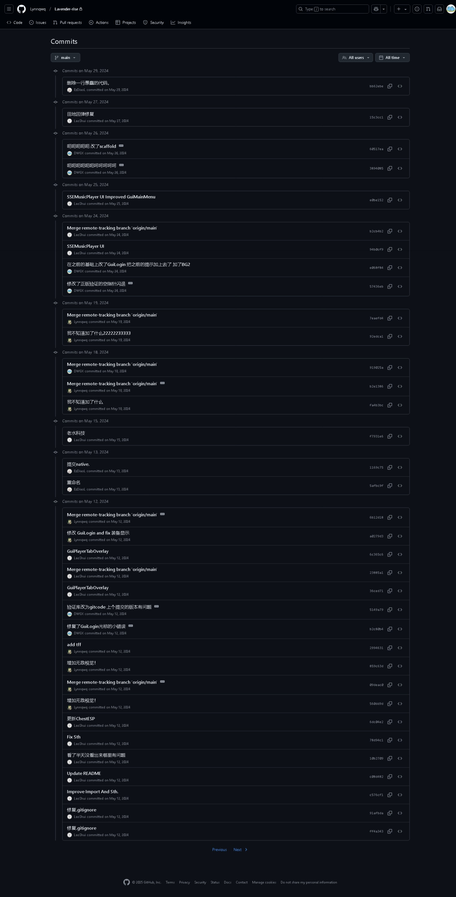
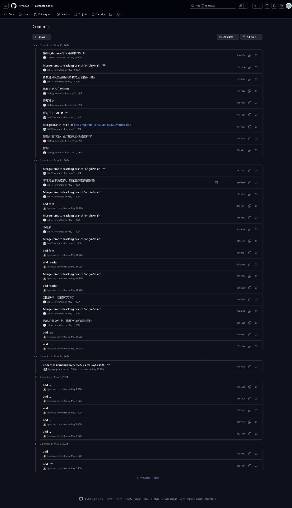
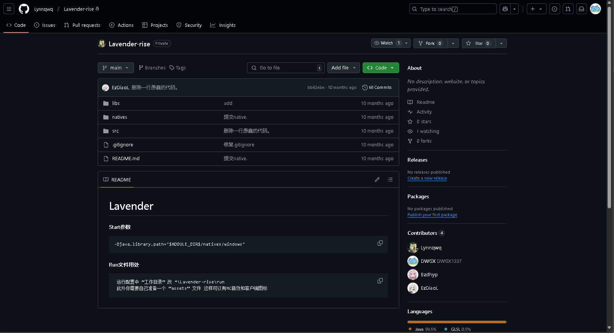

## Compliance Notice / 合规声明

- This repository is provided only for education, reverse engineering research, debugging, and interoperability study.
- Do not use any code or ideas here for unauthorized access, cheating in online services, privacy invasion, data theft, malware delivery, or service disruption.
- You must comply with applicable laws, platform Terms of Service, and software/game EULA before any use.
- If any content infringes your rights, open an issue or contact the maintainer for removal.
- Full statement: [DISCLAIMER.md](./DISCLAIMER.md)

---
# Lavender

###### It was my dream client when I was younger, but it was Abandoned a long time ago I shared something in the QQ group The source code is now republished in two versions THANK YOU, THE PEOPLE WHO WORKED WITH ME, THANK YOU LYNN EZDIAOL COMES FROM LOVE

---
#### Start参数
    -Djava.library.path="$MODULE_DIR$/natives/windows"

#### Run文件用处
     运行配置中 “工作目录” 改 *\Lavender-rise\run
     此外你需要自己准备一个 “assets” 文件 这样可以有MC音效和客户端图标

📂 开源重现

#### (https://github.com/EzDiaoL)
#### (https://github.com/Lynnqwq)

🖼️ 项目截图
我附上了三张图片，带你回顾 Lavender 的历史：
